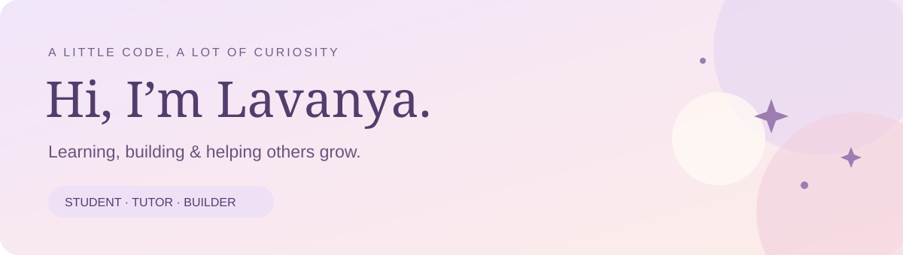

# 🌷 Hi there, I’m Lavanya Pillay

**🎓 Final-year Computer & Information Science student · 👩‍🏫 Tutor · 💻 Builder**

  
  

> 🌸 I started Computer Science with no coding background. Now I build applications, help other students learn, and keep finding new things to be curious about.

**Explore:** [🌷 About me](#about-me) · [🧰 My toolkit](#tech-stack) · [✨ Projects](#projects) · [👩‍🏫 Tutoring](#tutoring) · [💌 Connect](#connect)

---

## 🌷 A Little About Me

- 🎓 Final-year **Bachelor of Computer and Information Science** student at **IIE Varsity College**.
- 👩‍🏫 Experience tutoring **Programming and Cloud Development** at **Emeris**, currently tutoring Cloud Development.
- 🤝 Mentor to first-year students through **Emeris’ GRIT 3SIXT programme**.
- 📱 Enjoy building Android applications with **Kotlin and Jetpack Compose**.
- 📊 Exploring **data analysis** as my next area of focus.
- 🌱 Learning through practical projects, collaboration and helping others understand code.

---

## 🧰 My Toolkit

### 💻 Languages

  
  
  
  
  
  

### 📱 Development & Design

  
  
  
  
  

### ☁️ Cloud & Data

  
  
  
  
  

---

## ✨ Things I’ve Helped Build

Both projects below were developed collaboratively. Their repositories include the full application, team credits and details of my individual contribution.

### 🐱 [LuckyCat — Personal Finance Tracker](https://github.com/Lavanyax24/LuckyCat)

*Helping users make sense of where their money goes.*

An Android finance application built with a **five-person team**, featuring income and expense tracking, budget goals, receipt uploads and interactive analytics. Firebase Authentication and Supabase support the shared application.

**🌸 My contribution**

- 📊 **Analytics and graphs:** date-range controls, category spending charts with budget goal overlays, daily spending trends, and PDF/CSV exports.
- 🎨 **UI and theme:** visual design work and the analytics colour palette.
- ➕ **Expense entry:** the Create Expense screen, including numeric entry and category/date inputs.
- 🗂️ **Custom categories:** category creation with emoji icons.

   

[**Explore LuckyCat →**](https://github.com/Lavanyax24/LuckyCat)

---

### 🍃 [Elachi — Your Digital Kitchen Companion](https://github.com/Lavanyax24/Elachi)

*Collect recipes. Prepare your pantry. Cook with confidence.*

An Android recipe management application built with a **four-person team**, bringing together cookbooks, recipe scanning, pantry and shopping tools, guided cooking and an AI Chef. The complete system combines Kotlin/Compose with an Express API, Supabase and Firebase.

**🌸 My allocated contribution areas**

- 📖 **Cookbooks and recipes:** screens and ViewModels for recipe organisation, entry and details.
- 📷 **Scanning and cook mode:** camera/OCR interfaces, guided cooking, timers, spoken instructions, serving controls and recipe PDF export.
- 🥬 **Pantry and discovery:** pantry/shopping-list interfaces, ingredient units, kitchen timer, recipe search and filtering.
- 👩‍🍳 **AI Chef and progress:** Android chat screen/ViewModel, achievement progress interface and cooking streak calendar.

These areas follow the team allocation for Phases 4, 5a and 6b. My teammates’ workstreams included authentication, shared repositories, backend AI integration and server-side progression logic.

   

[**Explore Elachi →**](https://github.com/Lavanyax24/Elachi) · [**Watch the team demo 🎬**](https://youtu.be/_9Ekp7AXjG8)

---

## 👩‍🏫 Sharing What I Learn

Tutoring and mentoring are part of my journey alongside building software.

| Experience | Focus |
| :--- | :--- |
| ☁️ **Currently tutoring Cloud Development** | C#, ASP.NET MVC, SSMS and Microsoft Azure |
| 💻 **Programming tutoring experience** | Java and C# |
| 🤝 **GRIT 3SIXT mentoring** | Supporting first-year students at Emeris |

### 🌱 What I’m Exploring Next

**Data analysis** — bringing my interest in SQL and problem-solving into the way I explore and understand data.

---

## 💌 Let’s Connect

Happy to connect with fellow students, developers and people working in data. Reach out to talk about projects, learning or opportunities.

**💼 [LinkedIn](https://www.linkedin.com/in/lavanya-pillay-46a6a5373)** · **📧 [Email](mailto:lavanyapillay24@gmail.com)**

---

*🌷 A little code, a lot of curiosity — and always something new to learn.*

[⬆️ Back to top](#top)
